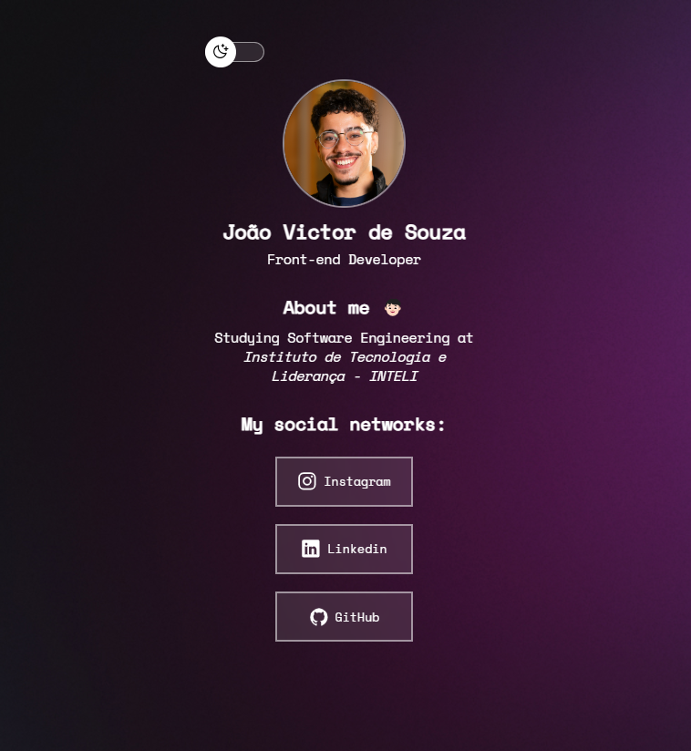

# New Linktree 

Este projeto é uma recriação da minha antiga **Linktree** utilizando **HTML**, **CSS**, e **JavaScript**. O objetivo é ter uma página simples e funcional para centralizar todos os meus links importantes de redes sociais e projetos em um único lugar, com um design personalizado.

## 🛠️ Tecnologias Utilizadas

- **HTML5**: Estruturação semântica do conteúdo.
- **CSS3**: Estilização e layout responsivo com flexbox e media queries.
- **JavaScript**: Funcionalidades interativas, como animações e controle de eventos.

## 📸 Screenshots

    
    

## 🚀 Funcionalidades

- **Design Responsivo**: Adapta-se a diferentes tamanhos de tela, incluindo dispositivos móveis.
- **Light Mode**: Suporte a modo claro, oferecendo uma melhor experiência em ambientes com muita luz.
- **Animações**: Efeitos de hover e transições suaves nos botões e links.
- **Links Personalizados**: Todos os links redirecionam corretamente para as minhas redes sociais e projetos.

## 📝 Aprendizados

- **Organização do código**: Mantive uma estrutura clara para facilitar a manutenção do projeto.
- **Responsividade**: Utilizei **media queries** e flexbox para garantir uma boa experiência em dispositivos móveis.
- **Interatividade**: Trabalhei com **JavaScript** para adicionar interações, como animações nos links e botões.
- **Light Mode**: Aprendi a implementar e ajustar temas de cores claras e escuras no design.

